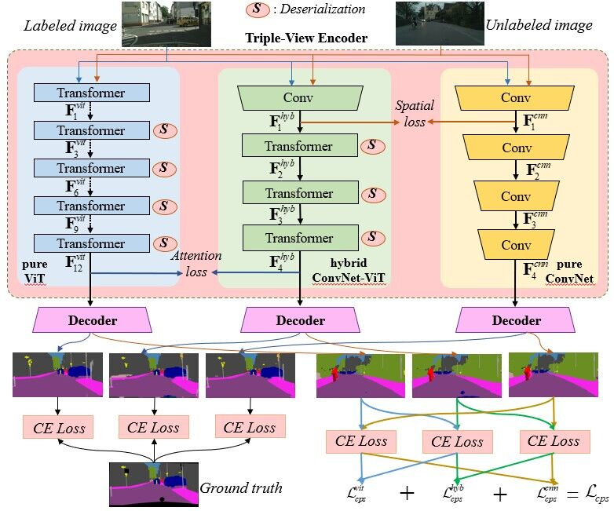
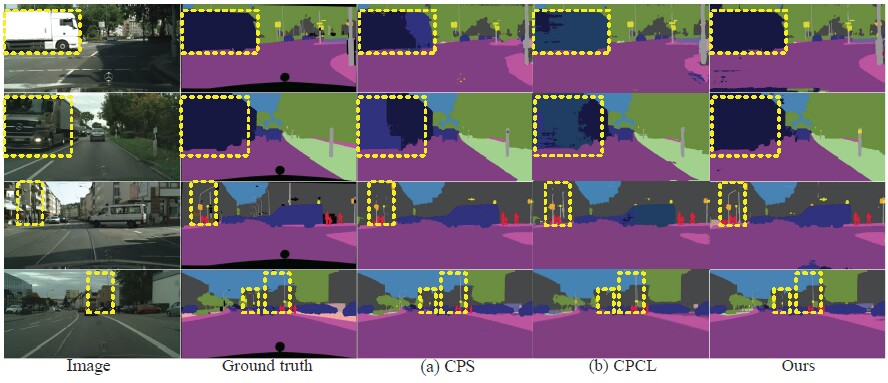

# Triple-View Knowledge Distillation for Semi-Supervised Semantic Segmentation
This is official pytorch implementation of "Triple-View Knowledge Distillation for
Semi-Supervised Semantic Segmentation". The paper is available  [here](https://arxiv.org/pdf/2309.12557).
<br/>

## Introduction
<br/>To alleviate the expensive human labeling, semisupervised semantic segmentation employs a few labeled images
and an abundant of unlabeled images to predict the pixel-level
label map with the same size. Previous methods often adopt
co-training using two convolutional networks with the same
architecture but different initialization, which fails to capture the
sufficiently diverse features. This motivates us to use tri-training
and develop the triple-view encoder to utilize the encoders with
different architectures to derive diverse features, and exploit the
knowledge distillation skill to learn the complementary semantics
among these encoders. Moreover, existing methods simply concatenate the features from both encoder and decoder, resulting
in redundant features that require large memory cost. This
inspires us to devise a dual-frequency decoder that selects those
important features by projecting the features from the spatial
domain to the frequency domain, where the dual-frequency
channel attention mechanism is introduced to model the feature
importance. Therefore, we propose a Triple-view Knowledge Distillation framework, termed TriKD, for semi-supervised semantic
segmentation, including the triple-view encoder and the dualfrequency decoder. Extensive experiments were conducted on
two benchmarks, i.e., Pascal VOC 2012 and Cityscapes, whose
results verify the superiority of the proposed method with a good
tradeoff between precision and inference speed.

## Install Dependencies
The code is written in Python 3.10 using the following libraries:

```
opencv-python
pyyaml
scipy
pillow==9.5.0
numpy==1.12.2
torch==1.12.1
torchsummary==1.5.1 
torchvision==0.13.1
tensorboard==1.15.0
```

Install the libraries using [requirements.txt](requirements.txt) as:

```
pip install -r requirements.txt
```

## Data
For training, download the cityscapes dataset from [here](https://www.cityscapes-dataset.com/) and please modify the path to the dataset in code.
<br/>


## Folder Structure
While training, the models are saved in a folder specifying the hyper-parameters for that run under the [exp](exp) directory, including the .pth file and the .log file. The directory structure looks like this:
```
TriKD_SemiSeg
│
├─configs
│      cityscapes_triple11m_512_e300.yaml
│      cityscapes_triple21m_512_e300.yaml
│      eval.yaml
│
├─dataset
│      semi.py
│      transform.py
│
├─exp
│      exp_log.txt
│
├─model
│  │  helpers.py
│  │  resnet101.pth
│  │  resnet50.pth
│  │
│  ├─backbone
│  │      resnet.py
│  │      tinyvit_kd.py
│  │      vit_kd.py
│  │      xception.py
│  │
│  └─semseg
│          decoder.py
│          deeplabv3plus.py
│          fft_attn.py
│          model_helper_kd.py
│          neck.py
│
├─pretrained
│      pretrained model.txt
│
├─scripts
│      eval.sh
│      train_TriKD_autocast.sh
│
├─splits
│  └─cityscapes
│      │  eval.txt
│      │  val.txt
│      │
│      ├─1_16
│      │      labeled.txt
│      │      unlabeled.txt
│      │
│      ├─1_2
│      │      labeled.txt
│      │      unlabeled.txt
│      │
│      ├─1_30
│      │      labeled.txt
│      │      unlabeled.txt
│      │
│      ├─1_4
│      │      labeled.txt
│      │      unlabeled.txt
│      │
│      └─1_8
│              labeled.txt
│              unlabeled.txt
│
├─util
│        classes.py
│        dist_helper.py
│        eval_helper.py
│        ohem.py
│        utils.py
│  eval.py
│  readme.md
│  requirements.txt
│  semi_TriKD_autocast.py
└─ TriKD.png
```

<br/>

## Quantitative results on Cityscapes
<table>
   <tr>
      <td>Model</td>
      <td>1/16</td>
      <td>1/8</td>
      <td>1/4</td>
      <td>1/2</td> 
   </tr>
   <tr>
      <td>TriVN 11M</td>
      <td>69.18</td>
      <td>73.25</td>
      <td>75.02</td>
      <td>75.98</td>
   </tr>
   <tr>
      <td>TriVN 21M</td>
      <td>72.70</td>
      <td>76.44</td>
      <td>78.01</td>
      <td>79.12</td>
   </tr>
</table>


## Qualitative results  on Cityscapes
<br/>


## Training & Testing
### Training the TriKD 21M:
Use the command below for training, modify the run-time arguments (like hyper-parameters for training, path to save the models, etc.) as required:
```
bash scripts/train_TriKD_autocast.sh 4 9527 
```

<br/>

### Training the TriKD 11M:
modify config_yaml='cityscapes_triple11m_512_e300.yaml' in the scripts/train_TriKD_autocast.sh and Use the command below for training:
```
bash scripts/train_TriKD_autocast.sh 4 9527 
```

### Testing the TriKD:
Before testing, place the trained model file and modify model_path='your model file path'in the scripts/eval.sh and use the command below for testing:
```
bash scripts/eval.sh
```
<br/>

## Citation

If you find this repo useful, please cite the following paper.

```
@article{li-tmm2025-trikd,
	title        = {Triple-view knowledge distillation for semi-supervised semantic segmentation},
	author       = {Ping Li and Junjie Chen and Li Yuan and Xianghua Xu and Mingli Song},
	journal      = {IEEE Transactions on Multimedia (TMM)},
	year         = {2025},
	doi          = {10.1109/TMM.2025.3639923}
}
```

## Contact

For any issues, please contact Mr. Chen Junjie via email cjj@hdu.edu.cn or Mr. Tang Chen via email tangc@hdu.edu.cn

## Acknowledgement
We would like to thank the authors of [U2PL](https://github.com/Haochen-Wang409/U2PL), which accelerated the development of our TriKD code. 

